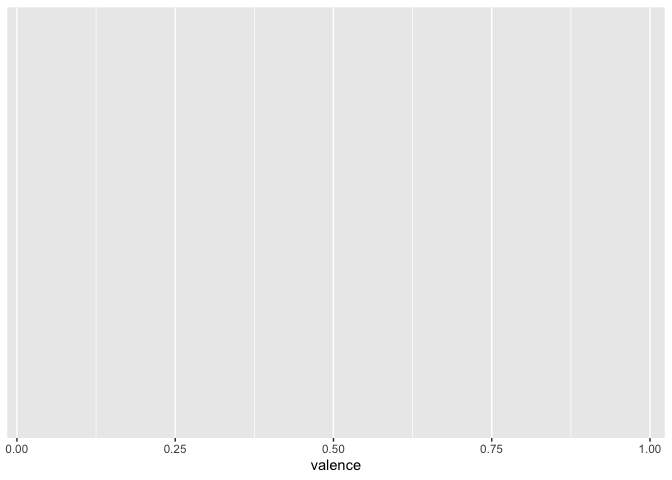
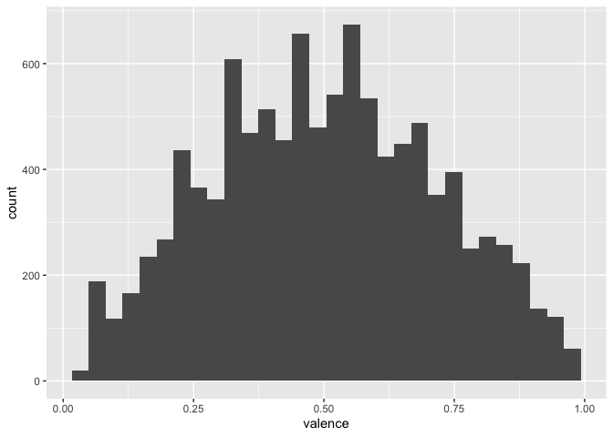
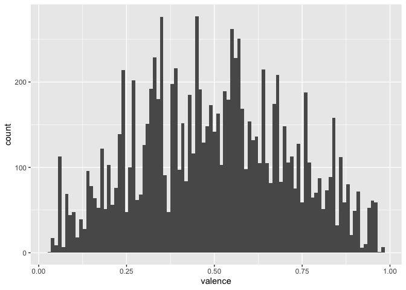
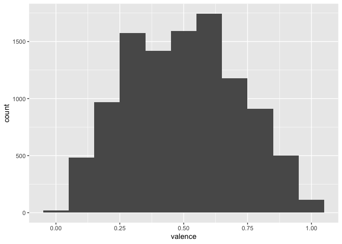
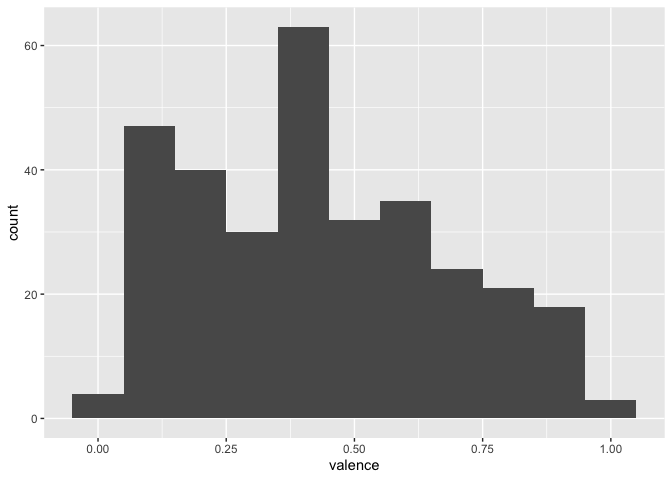
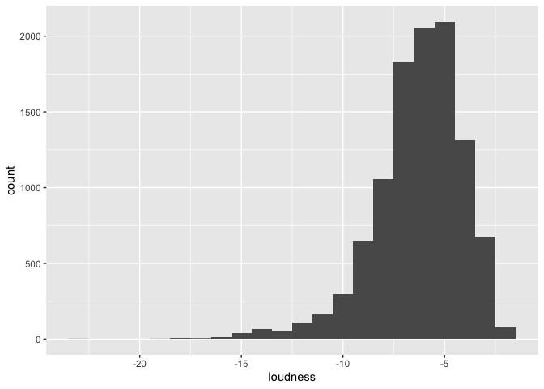

Isolating Data
================

[&lt;&lt;&lt; Previous](data-wrangling.md) \| [Next
&gt;&gt;&gt;](03_piping.md)

------------------------------------------------------------------------

This type of task occurs often in Data Science: you need to extract data
from a table before you can use it. You can do this task quickly with
two functions that come in the `dplyr` package:

1.  **select()** - which extracts columns from a data frame
2.  **filter()** - which extracts rows from a data frame

Each function takes a data frame or tibble as it’s first argument and
returns a new data frame or tibble as its output.

select()
--------

`select()` extracts columns of a data frame and returns the columns as a
new data frame. To use `select()`, pass it the name of a data frame to
extract columns from, and then the names of the columns to extract. The
column names do not need to appear in quotation marks or be prefixed
with a `$`; `select()` knows to find them in the data frame that you
supply.

A typical `select()` call looks like this:  
`select(<data>, <variables>)`

If you want to select the `loudness` variable, you run this:

    select(spotify, loudness)

    ## # A tibble: 10,500 x 1
    ##    loudness
    ##       <dbl>
    ##  1   -10.7 
    ##  2    -2.75
    ##  3    -7.05
    ##  4    -5.57
    ##  5    -3.71
    ##  6    -2.73
    ##  7    -5.63
    ##  8   -11.7 
    ##  9    -7.36
    ## 10    -7.05
    ## # … with 10,490 more rows

Notice how it returned a data frame of the `loudness` variable, rather
than a list or vector!

If you want to extract more than one variable you can include them,
separated by commas, as arguments to the function:  
`select(spotify, loudness, instrumentalness, key)`

Or, you can provide the variables as a vector! They will return the same
thing.

    select(spotify, c(loudness, instrumentalness, key))

    ## # A tibble: 10,500 x 3
    ##    loudness instrumentalness   key
    ##       <dbl>            <dbl> <dbl>
    ##  1   -10.7        0              1
    ##  2    -2.75       0              5
    ##  3    -7.05       0.00000911     6
    ##  4    -5.57       0              2
    ##  5    -3.71       0              8
    ##  6    -2.73       0              5
    ##  7    -5.63       0              1
    ##  8   -11.7        0              8
    ##  9    -7.36       0.00000178    11
    ## 10    -7.05       0.00000101     0
    ## # … with 10,490 more rows

A third option, in case you have many variables or aren’t sure of the
variable’s exact names, is to use `select helpers`.

------------------------------------------------------------------------

### select() helpers

You can also use a series of helpers with `select()`. For example, if
you place a minus sign before a column name, `select()` will return
every column but that column. The code below will return every column
except lyrics.

    select(spotify, -lyrics)

The table below summarizes most of the other `select()` helpers that are
available in `dplyr`. This is here for your reference and to demonstrate
the flexibility of `select()`

| Helper Function    | Use                                          | Example                                         |
|--------------------|----------------------------------------------|-------------------------------------------------|
| **-**              | Columns except                               | `select(spotify, -loudness)`                    |
| **:**              | Columns between (inclusive)                  | `select(spotify, loudness:danceability)`        |
| **contains()**     | Columns that contains a string               | `select(spotify, contains("d"))`                |
| **ends\_with()**   | Columns that ends with a string              | `select(spotify, ends_with("y"))`               |
| **matches()**      | Columns that matches a regex                 | `select(spotify, matches("n"))`                 |
| **num\_range()**   | Columns with a numerical suffix in the range | Not applicable with `spotify`                   |
| **one\_of()**      | Columns whose name appear in the given set   | `select(spotify, one_of(c("energy", "tempo")))` |
| **starts\_with()** | Columns that starts with a string            | `select(spotify, starts_with("e"))`             |

**Exercise 1**

Use the example below to get a feel for `select()`. Can you extract just
the `artist` column? How about the `artist` and `energy` columns?

    select(spotify, loudness)

    ## # A tibble: 10,500 x 1
    ##    loudness
    ##       <dbl>
    ##  1   -10.7 
    ##  2    -2.75
    ##  3    -7.05
    ##  4    -5.57
    ##  5    -3.71
    ##  6    -2.73
    ##  7    -5.63
    ##  8   -11.7 
    ##  9    -7.36
    ## 10    -7.05
    ## # … with 10,490 more rows

**Exercise 2**  
Use the `contains()` helper function to select the columns that contain
the letter “n”. The structure should look like this:
`select(spotify, contains("d"))`. What variables are returned?

------------------------------------------------------------------------

### Go further

The `tidyr` package allows you to reshape your entire data frame, rather
than perform simple operations with columns. It’s super helpful if you
need to, for instance, convert your *wide* data frame to a *long*
(i.e. *tidy*) data frame, or convert your nested JSON data to a tidy
data frame. For a short introduction, [check this
out](https://tidyr.tidyverse.org/)

------------------------------------------------------------------------

filter()
--------

`filter()` extracts rows from a data frame and returns them as a new
data frame. As with `select()`, the first argument of `filter()` should
be a data frame to extract rows from. The arguments that follow should
be logical tests; `filter()` will return every row for which the tests
return `TRUE`.

### Filter in action

For example, the code chunk below returns every track with a 5/4 time
signature in `spotify`. **7** has been on the charts for a while! Also,
I’m happy to see my man John Prine switching up his time signatures too.

    filter(spotify, time_signature == 5)

    ## # A tibble: 146 x 23
    ##     rank track artist week       danceability energy   key loudness  mode
    ##    <dbl> <chr> <chr>  <date>            <dbl>  <dbl> <dbl>    <dbl> <dbl>
    ##  1    27 Robb… Juice… 2019-03-02        0.685  0.692     2    -5.12     1
    ##  2    87 Wort… YK Os… 2019-03-02        0.749  0.535     5    -4.05     0
    ##  3    28 Robb… Juice… 2019-03-09        0.685  0.692     2    -5.12     1
    ##  4    73 Wort… YK Os… 2019-03-09        0.749  0.535     5    -4.05     0
    ##  5    34 Robb… Juice… 2019-03-16        0.685  0.692     2    -5.12     1
    ##  6    65 Wort… YK Os… 2019-03-16        0.749  0.535     5    -4.05     0
    ##  7    27 Robb… Juice… 2019-03-23        0.685  0.692     2    -5.12     1
    ##  8    62 Wort… YK Os… 2019-03-23        0.749  0.535     5    -4.05     0
    ##  9    35 Robb… Juice… 2019-03-30        0.685  0.692     2    -5.12     1
    ## 10    56 Wort… YK Os… 2019-03-30        0.749  0.535     5    -4.05     0
    ## # … with 136 more rows, and 14 more variables: speechiness <dbl>,
    ## #   acousticness <dbl>, instrumentalness <dbl>, liveness <dbl>, valence <dbl>,
    ## #   tempo <dbl>, duration_ms <dbl>, time_signature <dbl>, month <chr>,
    ## #   day <dbl>, year <dbl>, season <chr>, time_since_covid <dbl>,
    ## #   covid_period <chr>

### Logical tests

To get the most from filter, you will need to know how to use R’s
logical test operators, which are summarized below.

| Logical operator | tests                                | Example     |
|------------------|--------------------------------------|-------------|
| **&gt;**         | Is `x` greater than `y`?             | `x > y`     |
| **&gt;=**        | Is `x` greater than or equal to `y`? | `x >= y`    |
| **&lt;**         | Is `x` less than `y`?                | `x < y`     |
| **&lt;=**        | Is `x` less than or equal to `y`?    | `x <= y`    |
| **==**           | Is `x` equal to `y`?                 | `x == y`    |
| **!=**           | Is `x` not equal to `y`?             | `x != y`    |
| **is.na()**      | Is `x` an `NA`?                      | `is.na(x)`  |
| **!is.na()**     | Is `x` not an `NA`?                  | `!is.na(x)` |

------------------------------------------------------------------------

Let’s look at another example before moving on to exercises. Tracks with
an `instrumentalness` value greater than 0.5 are considered to likely be
instrumental, according to the [metadata](data/meta.html). Let’s see
which tracks are instrumental!

    filter(spotify, instrumentalness > 0.5)

    ## # A tibble: 43 x 23
    ##     rank track artist week       danceability energy   key loudness  mode
    ##    <dbl> <chr> <chr>  <date>            <dbl>  <dbl> <dbl>    <dbl> <dbl>
    ##  1    65 How … Offse… 2019-03-09        0.71   0.578     0    -6.20     0
    ##  2    60 How … Drake  2019-08-17        0.595  0.86      5    -5.37     0
    ##  3    93 Fear… Tool   2019-08-17        0.31   0.584     7   -10.1      1
    ##  4    85 In M… Frank… 2019-11-16        0.861  0.647     7    -7.42     1
    ##  5    74 Ever… Billi… 2019-11-23        0.704  0.225     6   -14.5      0
    ##  6     8 Ever… Billi… 2019-11-30        0.704  0.225     6   -14.5      0
    ##  7    26 Ever… Billi… 2019-12-07        0.704  0.225     6   -14.5      0
    ##  8    25 Ever… Billi… 2019-12-14        0.704  0.225     6   -14.5      0
    ##  9    30 Ever… Billi… 2019-12-21        0.704  0.225     6   -14.5      0
    ## 10    34 Ever… Billi… 2019-12-28        0.704  0.225     6   -14.5      0
    ## # … with 33 more rows, and 14 more variables: speechiness <dbl>,
    ## #   acousticness <dbl>, instrumentalness <dbl>, liveness <dbl>, valence <dbl>,
    ## #   tempo <dbl>, duration_ms <dbl>, time_signature <dbl>, month <chr>,
    ## #   day <dbl>, year <dbl>, season <chr>, time_since_covid <dbl>,
    ## #   covid_period <chr>

Huh, it seems like this isn’t a strict enough filter. There are quite a
few tracks that definitely have words in them here. Let’s increase the
filter to 0.8 and see where that gets us.

    filter(spotify, instrumentalness > 0.8)

    ## # A tibble: 4 x 23
    ##    rank track artist week       danceability energy   key loudness  mode
    ##   <dbl> <chr> <chr>  <date>            <dbl>  <dbl> <dbl>    <dbl> <dbl>
    ## 1    50 Can I Kehla… 2020-05-23        0.641  0.842     9    -7.27     1
    ## 2    47 Deck… Nat K… 2020-12-26        0.72   0.487    10   -10.2      1
    ## 3   100 Beau… Kid C… 2020-12-26        0.331  0.513    11   -15.4      0
    ## 4    43 Deck… Nat K… 2021-01-02        0.72   0.487    10   -10.2      1
    ## # … with 14 more variables: speechiness <dbl>, acousticness <dbl>,
    ## #   instrumentalness <dbl>, liveness <dbl>, valence <dbl>, tempo <dbl>,
    ## #   duration_ms <dbl>, time_signature <dbl>, month <chr>, day <dbl>,
    ## #   year <dbl>, season <chr>, time_since_covid <dbl>, covid_period <chr>

Jeez Spotify, I don’t think `instrumentalness` is a very accurate
metric! Or something may have gone wrong when I was mining the data…
This goes to show- exploring your data beforehand will help you catch
errors early so they don’t make it into your analyses!

**Exercise 3**

See if you can use the logical operators to manipulate our code below to
show:

-   All of the songs in the “post\_covid” `covid_period`
-   All of the songs where `tempo` is less than or equal to 80
-   *Stretch challenge*. All songs that have more than 20 characters in
    their title. Hint: you will need to use the `nchar()` function.

<!-- -->

    filter(spotify, covid_period == "pre_covid")

------------------------------------------------------------------------

### Two common mistakes

When you use logical tests, be sure to look out for two common mistakes.
One appears in each code chunk below. Can you find them? When you spot a
mistake, fix it and then run the chunk to confirm that it works.

    filter(spotify, artist = "DaBaby")

    filter(spotify, artist == DaBaby)

**Answer**

    filter(spotify, artist == "DaBaby")

    ## # A tibble: 114 x 23
    ##     rank track artist week       danceability energy   key loudness  mode
    ##    <dbl> <chr> <chr>  <date>            <dbl>  <dbl> <dbl>    <dbl> <dbl>
    ##  1    87 Suge  DaBaby 2019-04-13        0.876  0.662     2    -6.48     0
    ##  2    63 Suge  DaBaby 2019-04-20        0.876  0.662     2    -6.48     0
    ##  3    51 Suge  DaBaby 2019-04-27        0.876  0.662     2    -6.48     0
    ##  4    46 Suge  DaBaby 2019-05-04        0.876  0.662     2    -6.48     0
    ##  5    27 Suge  DaBaby 2019-05-11        0.876  0.662     2    -6.48     0
    ##  6    22 Suge  DaBaby 2019-05-18        0.876  0.662     2    -6.48     0
    ##  7    16 Suge  DaBaby 2019-05-25        0.876  0.662     2    -6.48     0
    ##  8    14 Suge  DaBaby 2019-06-01        0.876  0.662     2    -6.48     0
    ##  9     9 Suge  DaBaby 2019-06-08        0.876  0.662     2    -6.48     0
    ## 10     8 Suge  DaBaby 2019-06-15        0.876  0.662     2    -6.48     0
    ## # … with 104 more rows, and 14 more variables: speechiness <dbl>,
    ## #   acousticness <dbl>, instrumentalness <dbl>, liveness <dbl>, valence <dbl>,
    ## #   tempo <dbl>, duration_ms <dbl>, time_signature <dbl>, month <chr>,
    ## #   day <dbl>, year <dbl>, season <chr>, time_since_covid <dbl>,
    ## #   covid_period <chr>

### Two mistakes - Recap

When you use logical tests, be sure to look out for these two common
mistakes:

1.  using `=` instead of `==` to test for equality.
2.  forgetting to use quotation marks when comparing strings,
    e.g. `artist == DaBaby`, instead of `genre == "DaBaby"`

### Go further: Boolean operators

You can find a complete list of base R’s boolean operators in the table
below. This is here for your reference.

| Boolean operator | represents                                 | Example             |
|------------------|--------------------------------------------|---------------------|
| **&**            | Are *both* `A` and `B` true?               | `A & B`             |
| `|`              | Are *one or both* of `A` and `B` true?     | `A | B`             |
| **!**            | Is `A` *not* true?                         | `!A`                |
| **xor()**        | Is *one and only one* of `A` and `B` true? | `xor(A, B)`         |
| **%in%**         | Is `x` in the set of `a`, `b`, and `c`?    | `x %in% c(a, b, c)` |
| **any()**        | Are *any* of `A`, `B`, or `C` true?        | `any(A, B, C)`      |
| **all()**        | Are *all* of `A`, `B`, or `C` true?        | `all(A, B, C)`      |

These allow you to customize filtered searches according to a variety of
criteria. We’re not going to go into depth about all of these here. The
basic Boolean operators we will focus on today are **&** and `|` (or).

If you provide more than one test to `filter()`, `filter()` will combine
the tests with an **and** statement (`&`): it will only return the rows
that satisfy all of the tests.

For instance,

    filter(spotify, mode == 0, tempo > 80)

will only return songs that are in a minor key **and** are faster than
80 beats per minute. Run this code and see how many observations are
returned.

Now, try this.

    filter(spotify, mode == 0 | tempo > 80)

Many more observations are returned because the function is filtering
for songs that are in a minor key **or** have a tempo greater than 80
beats per minute. A song only has to satisfy one of the criteria to pass
the filter.

------------------------------------------------------------------------

### Go further: stringr

The `stringr` package is very helpful for manipulating strings in R.
It’s part of the core tidyverse set of packages, so it is easy to
integrate into your data wrangling pipeline. It takes some of the pain
away from forming your own `regex` expressions, but is flexible enough
to accomodate complex cases. I use `stringr` regularly within `filter()`
and other data manipulation functions. If you’re interested, check out
[this light introduction](https://stringr.tidyverse.org/).

------------------------------------------------------------------------

Visualizing Distributions
-------------------------

We’re going to kick off the data visualization segment with an
introduction to the `ggplot2` package and a simple, but important task-
visualizing distributions.

### Plotting with ggplot2

`ggplot2` is a plotting package that makes it simple to create complex
plots from data in a data frame. It stands for “grammar of graphics
plot” and the 2 comes from its total redesign after the creator [Hadley
Wickham](http://hadley.nz/) scrapped the original package. The [grammar
of graphics](https://vita.had.co.nz/papers/layered-grammar.html) is a
useful framework to describe the components of a graphic. It provides a
more programmatic interface for specifying what variables to plot, how
they are displayed, and general visual properties. Therefore, we only
need minimal changes if the underlying data change or if we decide to
change from a bar plot to a scatter plot. This gives us a lot of
customization flexibility with reasonable defaults.

In practical terms,

-   `ggplot2` functions like tidy data. Well-structured data will save
    you lots of time when making figures.

-   `ggplot2` graphics are built step by step by adding new elements.
    Adding layers in this fashion allows for extensive flexibility and
    customization of plots.

### The basics

To build a ggplot, we will use the following basic template that can be
used for different types of plots:

`ggplot(data = < DATA > , aes( < MAPPINGS > )) +  geom_FUNCTION()`

*data* Bind the plot to a specific data frame using the data argument

*aes()* Use the aes() (aesthetics) function to select the variables to
be plotted and specify how to present them in the graph, e.g. as x/y
positions or characteristics such as size, shape, color, etc.

*geom* Add ‘geoms’ – graphical representations of the data in the plot
(points, lines, bars). Here are some examples:

`geom_point()` for scatter plots, dot plots, etc. `geom_smooth()` for
trendlines `geom_boxplot()` for boxplots `geom_histogram()` for
histograms

Plot components are tied together using the `+` operator. You can add
`geom_*`s, for instance plotting both a scatterplot and a trendline:

`ggplot() + geom_point() + geom_smooth()`,

or add components that customize the plot- we will get to this part
later.

Let’s build a plot, piece by piece!

### Building a plot

Visualizing the distribution of your data is one of the most fundamental
methods of data exploration. We’ll learn the fundamentals of `ggplot2`
while making a fundamental plot!

Every plot begins with a call to `ggplot()` (no **2**! That’s only in
the package name). First, we have to specify the data with the `data =`
argument. In addition, we need to specify what variables we’re plotting
and which axes we’re plotting them on. These are considered plot
aesthetics and are specified within the `aes()` function.

Let’s visualize the distribution of `valence`! It is Spotify’s derived
metric that describes the “happiness” and “positivity” of a song. Since
we’re visualizing a single variable, we only provide an aesthetic for
the x axis.

    ggplot(data = spotify, aes(x = valence))

<!-- -->

As you can see, we get a mostly blank plot when we run the `ggplot`
function! That’s because we haven’t told `ggplot` what type of `geom_`
we want. `ggplot` sets the framework that the rest of the components
inherit. Every plot component that follows will use `spotify` as the
data set and `valence` as the x-axis data, unless otherwise specified.

Let’s make something classic- a histogram. It’s easy- just specify the
geom!

    ggplot(data = spotify, aes(x = valence)) +
      geom_histogram()

    ## `stat_bin()` using `bins = 30`. Pick better value with `binwidth`.

    ## Warning: Removed 1 rows containing non-finite values (stat_bin).

<!-- -->

Huh, you got a funny message-  
“`stat_bin()` using `bins = 30`. Pick better value with `binwidth`.”

`ggplot` defaults to using 30 bins, but that may not always be the best
choice. Different values can highlight aspects about your distribution
that may be useful or obscure important patterns. We can play with the
`binwidth` argument to adjust how wide each bin is in the units of our
data. Let’s make them extra narrow. Notice how we specify the `binwidth`
argument within the call to `geom_histogram`- that’s because it is an
argument specific to this geom!

    ggplot(data = spotify, aes(x = valence)) +
      geom_histogram(binwidth = 0.01)

    ## Warning: Removed 1 rows containing non-finite values (stat_bin).

<!-- -->

I don’t think this uncovers patterns and just adds noise to the
distribution. Let’s widen those binwidths.

    ggplot(data = spotify, aes(x = valence)) +
      geom_histogram(binwidth = 0.1)

    ## Warning: Removed 1 rows containing non-finite values (stat_bin).

<!-- -->

I like this a bit better- the distribution looks to be mostly normal
with a bit of a right-skew. Most songs appear to be middle of the road
in their positivity.

I’m curious- the COVID pandemic has been extremely tough on the psyche
of, I imagine, most people. Does this show up in our choice of pop
music? Let’s use our data isolation skillset to see if music from a time
period before the pandemic (a random week in March 2019) was happier
than the long-term average. We need to `filter` our data set for
pre-COVID songs and then visualize the valence of those songs. The
variable that contains this information is the `covid_period` variable,
where `pre_covid` indicates the pre-COVID time frame.

    # first filter for minor key songs
    pre_covid <- filter(spotify, covid_period == "pre_covid")

    # now, visualize a histogram of the valence for these songs
    ggplot(data = pre_covid, aes(x = valence)) +
      geom_histogram(binwidth = 0.1)

<!-- -->

Interesting! There doesn’t seem to be a large change (if any). I think
it would be cool to visualize the different periods of the COVID
pandemic side-by-side to better visualize this difference. We’ll learn
this in the next data visualization segment!

While these plots aren’t too pretty, they get the message across. We
will learn how to spruce up the plots in a bit!

**Exercise 4**  
Try to make your own ggplot! Visualize a histogram of the `loudness`
variable. Play around with the binwidths to get a feel of how this
variable is distributed! If you’re feeling a bit ambitious, see if you
can filter the data by another variable (like `covid_period` perhaps?)
before you create the visualization to see if there is an interesting
pattern not obvious in the full dataset.

------------------------------------------------------------------------

### Go further

Although this isn’t an R-specific book, Claus Wilke’s (free)
[Fundamentals of Data Visualization](https://serialmentor.com/dataviz/)
is a must-read for those trying to up their data-viz game. He’s a
contributor to the ggplot2 package, and even made a couple of packages
that complement ggplot2, like
[cowplot](https://github.com/wilkelab/cowplot) for stitching together
plots and annotating them,
[ggridges](https://github.com/wilkelab/ggridges) for creating partially
overlapping line plots that look like mountain ranges (or that one Joy
Division album cover), and [ggtext](https://github.com/wilkelab/ggtext),
which allows you to add Markdown and HTML formatted text to your
ggplots. Super cool stuff! The book doesn’t contain R code and isn’t a
“this is how you make this plot in R” book, but that type of info is
available in many other places, like [From data to
viz](https://www.data-to-viz.com/).

------------------------------------------------------------------------

Answers
-------

**Exercise 1**

    select(spotify, artist)
    select(spotify, artist, energy)

**Exercise 2**

    spotify %>% select(contains("n"))

    ## # A tibble: 10,500 x 14
    ##     rank danceability energy loudness speechiness acousticness instrumentalness
    ##    <dbl>        <dbl>  <dbl>    <dbl>       <dbl>        <dbl>            <dbl>
    ##  1     1        0.778  0.317   -10.7       0.334       0.592         0         
    ##  2     2        0.687  0.792    -2.75      0.0452      0.191         0         
    ##  3     3        0.752  0.488    -7.05      0.0705      0.297         0.00000911
    ##  4     4        0.76   0.479    -5.57      0.0466      0.556         0         
    ##  5     5        0.834  0.73     -3.71      0.222       0.00513       0         
    ##  6     6        0.579  0.904    -2.73      0.0618      0.193         0         
    ##  7     7        0.717  0.653    -5.63      0.0658      0.229         0         
    ##  8     8        0.837  0.364   -11.7       0.276       0.149         0         
    ##  9     9        0.829  0.539    -7.36      0.208       0.136         0.00000178
    ## 10    10        0.611  0.462    -7.05      0.0646      0.558         0.00000101
    ## # … with 10,490 more rows, and 7 more variables: liveness <dbl>, valence <dbl>,
    ## #   duration_ms <dbl>, time_signature <dbl>, month <chr>, season <chr>,
    ## #   time_since_covid <dbl>

**Exercise 3**

    filter(spotify, covid_period == "post_covid")
    filter(spotify, tempo <= 80)
    filter(spotify, nchar(track) > 20)

**Exercise 4**

    ggplot(data = spotify, aes(x = loudness)) +
      geom_histogram(binwidth = 1)

    ## Warning: Removed 1 rows containing non-finite values (stat_bin).

<!-- -->

I thought it would be cool to see if top 40 songs are louder! I filtered
for all songs with a rank equal to or below 40 before visualizing
loudness. It looks to be the case! This filter at least got rid of some
of the quieter outliers. I took a look at the extra quiet song, and it
looks like DaBaby’s song Baby on Baby wanted to keep it quiet for the
babies.

    top40_songs <- filter(spotify, rank <= 40)

    ggplot(data = top40_songs, aes(x = loudness)) +
      geom_histogram(binwidth = 1)

<!-- -->

------------------------------------------------------------------------

[&lt;&lt;&lt; Previous](data-wrangling.md) \| [Next
&gt;&gt;&gt;](03_piping.md)
