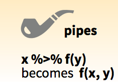

Piping
================

[\<\<\< Previous](02_isolating-data.md) | [Next
\>\>\>](04_summarizing-data.md)

-----

## %\>%

### Steps

Notice how each dplyr function takes a data frame as input and returns a
data frame as output. This makes the functions easy to use in a step by
step fashion. For example, you could:

1.  Filter `spotify` to just Rap songs, then
2.  Select the `loudness` and `energy` columns from the result

<!-- end list -->

``` r
rap <- filter(spotify, genre == "Rap")
rap <- select(rap, loudness, energy)
rap
```

    ## # A tibble: 1,000 x 2
    ##    loudness energy
    ##       <dbl>  <dbl>
    ##  1    -6.71  0.570
    ##  2   -13.1   0.297
    ##  3    -5.05  0.638
    ##  4    -6.58  0.705
    ##  5   -10.6   0.612
    ##  6    -8.97  0.762
    ##  7    -4.57  0.580
    ##  8    -7.00  0.656
    ##  9    -5.76  0.503
    ## 10    -8.42  0.593
    ## # … with 990 more rows

### Redundancy

The result shows us the loudest rap songs and their energy levels in our
data set. But take a look at the code. Do you notice how we re-create
`rap` at each step so we will have something to pass to the next step?
This is an inefficient way to write R code.

You could avoid creating `rap` by nesting your functions inside of each
other, but this creates code that is hard to read:

``` r
select(filter(spotify, genre == "Rap"), loudness, energy)
```

The dplyr package provides a third way to write sequences of functions:
the pipe.

### %\>%



The pipe operator `%>%` performs an extremely simple task: it passes the
result on its left into the first argument of the function on its right.
Or put another way, `x %>% f(y)` is the same as `f(x, y)`. This piece of
code punctuation makes it easy to write and read series of functions
that are applied in a step by step way. For example, we can use the pipe
to rewrite our code above:

``` r
spotify %>% 
  filter(genre == "Rap") %>% 
  select(loudness, energy)
```

    ## # A tibble: 1,000 x 2
    ##    loudness energy
    ##       <dbl>  <dbl>
    ##  1    -6.71  0.570
    ##  2   -13.1   0.297
    ##  3    -5.05  0.638
    ##  4    -6.58  0.705
    ##  5   -10.6   0.612
    ##  6    -8.97  0.762
    ##  7    -4.57  0.580
    ##  8    -7.00  0.656
    ##  9    -5.76  0.503
    ## 10    -8.42  0.593
    ## # … with 990 more rows

As you read the code, pronounce `%>%` as “then”. You’ll notice that
dplyr makes it easy to read pipes. Each function name is a verb, so our
code resembles the statement, “Take spotify, *then* filter it by genre,
*then* select the loudness and energy.”

dplyr also makes it easy to write pipes. Each dplyr function returns a
data frame that can be piped into another dplyr function, which will
accept the data frame as its first argument. In fact, dplyr functions
are written with pipes in mind: each function does one simple task.
dplyr expects you to use pipes to combine these simple tasks to produce
sophisticated results.

**Exercise 1**

We’ll use pipes for the remainder of the tutorial. Let’s practice a
little by writing a new pipe. The pipe should:

1.  Filter spotify to just the songs that are above 0.50 danceability
2.  Select the `tempo` and `energy` columns

-----

## Answers

**Exercise 1**

``` r
spotify %>% 
  filter(danceability > 0.50) %>% 
  select(tempo, energy) 
```

    ## # A tibble: 16,727 x 2
    ##    tempo energy
    ##    <dbl>  <dbl>
    ##  1  79.8  0.647
    ##  2 141.   0.917
    ##  3  93.1  0.606
    ##  4 126.   0.973
    ##  5 108.   0.919
    ##  6 132.   0.889
    ##  7 119.   0.761
    ##  8  79.6  0.611
    ##  9 120.   0.613
    ## 10 100.   0.816
    ## # … with 16,717 more rows

-----

[\<\<\< Previous](02_isolating-data.md) | [Next
\>\>\>](04_summarizing-data.md)
