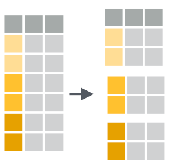
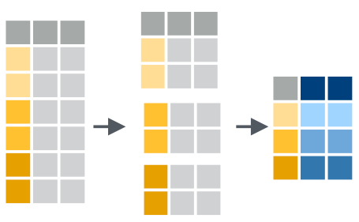

Summarizing data
================

[\<\<\< Previous](03_piping.md)

-----

## summarise()


Every data frame that you meet implies more information than it
displays. For example, `spotify` does not display the average energy of
a genre, but `spotify` certainly implies what that number is. To
discover the number, you only need to do a calculation:

``` r
spotify %>% 
  filter(genre == "Rock") %>% 
  summarise(avg_energy = mean(energy))
```

    ## # A tibble: 1 x 1
    ##   avg_energy
    ##        <dbl>
    ## 1      0.682

`summarise()` takes a data frame and uses it to calculate a new data
frame of summary statistics.

### Syntax

To use `summarise()`, pass it a data frame and then one or more named
arguments. Each named argument should be set to an R expression that
generates a single value. Summarise will turn each named argument into a
column in the new data frame. The name of each argument will become the
column name, and the value returned by the argument will become the
column contents.

### Example

I used `summarise()` above to calculate the average energy of songs in
the “Rock” genre, but let’s expand that code to also calculate

  - `max` - the rock song with the most energy
  - `sum` - the total energy of all rock songs in the data set

<!-- end list -->

``` r
spotify %>%
  filter(genre == "Rock") %>%
  summarise(
    avg_energy = mean(energy),
    max_energy = max(energy),
    total_energy = sum(energy)
  )
```

    ## # A tibble: 1 x 3
    ##   avg_energy max_energy total_energy
    ##        <dbl>      <dbl>        <dbl>
    ## 1      0.682      0.995         682.

Wow. Look at that efficient use of pipes (`%>%`) AND `summarise()`\!

**Exercise 1**

Compute these three statistics:

  - the average loudness of blues songs (`mean()`)
  - the maximum danceability of any blues song (`max()`)
  - the minimum energy of any blues song (`min()`)

Remember, you will have to use `filter()` to filter for blues songs\!

-----

### summarise by groups?

How can we apply `summarise()` to find the average energy for each genre
in `spotify`? You’ve seen how to calculate the average energy of a
genre, which gives us the answer for a single genre of interest:

``` r
spotify %>% 
  filter(genre == "Blues") %>% 
  summarise(avg_energy = mean(energy))
```

    ## # A tibble: 1 x 1
    ##   avg_energy
    ##        <dbl>
    ## 1      0.627

However, we had to isolate the genre from the rest of the data to
calculate this number. You could imagine writing a program that goes
through each genre one at a time and:

1.  filters out the rows with just that genre
2.  applies summarise to the rows

Eventually, the program could combine all of the results back into a
single data set. However, you don’t need to write such a program; this
is the job of dplyr’s `group_by()` function.

## group\_by()



`group_by()` takes a data frame and then the names of one or more
columns in the data frame. It returns a copy of the data frame that has
been “grouped” into sets of rows that share identical combinations of
values in the specified columns.

### group\_by() in action

For example, the result below is grouped into rows that have the same
genre.

``` r
spotify %>%
  group_by(genre)
```

    ## # A tibble: 26,000 x 6
    ## # Groups:   genre [26]
    ##    genre    energy loudness tempo danceability lyrics                           
    ##    <chr>     <dbl>    <dbl> <dbl>        <dbl> <chr>                            
    ##  1 Alterna…  0.647    -8.51  79.8        0.709 into into into of him by economi…
    ##  2 Alterna…  0.735    -4.75 163.         0.436 paying fishing realizes Johnson …
    ##  3 Alterna…  0.917    -6.09 141.         0.544 man has happened then to his by …
    ##  4 Alterna…  0.606    -5.06  93.1        0.603 realizes him Johnson I flees his…
    ##  5 Alterna…  0.641    -5.10 142.         0.487 she he his by before then depict…
    ##  6 Alterna…  0.973    -3.64 126.         0.524 she mainland Mark Mr. depicts ec…
    ##  7 Alterna…  0.919    -5.94 108.         0.657 by charter forced into who is aw…
    ##  8 Alterna…  0.889    -4.43 132.         0.611 by forced any Mark slipping main…
    ##  9 Alterna…  0.761    -4.47 119.         0.675 Mark she mainland without Johnso…
    ## 10 Alterna…  0.611    -5.74  79.6        0.584 away airplane I his his she man …
    ## # … with 25,990 more rows

### Using group\_by()



By itself, `group_by()` doesn’t do much. It assigns grouping criteria
that is stored as metadata alongside the original data set. If your
dataset is a tibble, as above, R will tell you that the data is grouped
at the top of the tibble display. In all other aspects, the data looks
the same.

However, when you apply a dplyr function like `summarise()` to grouped
data, dplyr will execute the function in a groupwise manner. Instead of
computing a single summary for the entire data set, dplyr will compute
individual summaries for each group and return them as a single data
frame. The data frame will contain the summary columns as well as the
columns in the grouping criteria, which makes the result decipherable:

``` r
spotify %>%
  group_by(genre) %>% 
  summarise(min_loud = min(loudness))
```

    ## # A tibble: 26 x 2
    ##    genre            min_loud
    ##    <chr>               <dbl>
    ##  1 Alternative         -22.2
    ##  2 Anime               -30.7
    ##  3 Blues               -24.8
    ##  4 Children's Music    -29.5
    ##  5 Children’s Music    -18.4
    ##  6 Classical           -47.6
    ##  7 Comedy              -29.2
    ##  8 Country             -24.7
    ##  9 Dance               -16.5
    ## 10 Electronic          -23.4
    ## # … with 16 more rows

To understand exactly what `group_by()` is doing, remove the line
`group_by(genre) %>%` from the code above and rerun it. How do the
results change?

**Exercise 2** How would you go about finding the

### Go further

The `mutate()` function is another highly useful tool for extracting
unseen insights from your dataframe. While `select()` allows you to
choose columns and `group_by()` allows you to summarise rows, `mutate()`
enables you to perform calculations and other manipulations on all data
within a column. For instance, you’re able perform arithmetic on numeric
columns or create a new column that is a combination of two existing
columns. For a light introduction, [check this
out](https://dplyr.tidyverse.org/reference/mutate.html).

## Put it all together

\*\* Woo\! You now have the tools necessary to answer our original
question: Which of your favorite music genres will pep you up the most?
To answer this question, you need to:

1.  select the columns you need (`genre` and `energy`)
2.  filter for your **4** genres of interest
3.  group the genres
4.  calculate the mean energy for each genre

First, I’ll show you what genres you have to work with. Although it’s
not a focus of this workshop, the `unique()` function is quite useful
when you want to know the unique values of a variable.

``` r
unique(spotify$genre)
```

    ##  [1] "Alternative"      "Anime"            "Blues"            "Children's Music"
    ##  [5] "Children’s Music" "Classical"        "Comedy"           "Country"         
    ##  [9] "Dance"            "Electronic"       "Folk"             "Hip-Hop"         
    ## [13] "Indie"            "Jazz"             "Movie"            "Opera"           
    ## [17] "Pop"              "R&B"              "Rap"              "Reggae"          
    ## [21] "Reggaeton"        "Rock"             "Ska"              "Soul"            
    ## [25] "Soundtrack"       "World"

Now time to try it out\!

-----

### Recap

Congratulations\! You can use dplyr’s grammar of data manipulation to
access any data associated with a table—even if that data is not
currently displayed by the table.

In other words, you now know how to look at data in R, as well as how to
access specific values and calculate summary statistics.

## Answers

**Exercise 1**

``` r
spotify %>%
  filter(genre == "Blues") %>%
  summarise(
    avg_loud = mean(loudness),
    max_dance = max(danceability),
    min_energy = min(energy)
  )
```

    ## # A tibble: 1 x 3
    ##   avg_loud max_dance min_energy
    ##      <dbl>     <dbl>      <dbl>
    ## 1    -8.73     0.943     0.0432

**Exercise 2**

Using the `|` (or) Boolean operator

``` r
spotify %>% 
  select(genre, energy) %>% 
  filter(genre == "Ska" | genre == "Rock" | genre == "Rap" | genre == "Indie") %>% 
  group_by(genre) %>% 
  summarize(avg_energy = mean(energy)) 
```

    ## # A tibble: 4 x 2
    ##   genre avg_energy
    ##   <chr>      <dbl>
    ## 1 Indie      0.592
    ## 2 Rap        0.649
    ## 3 Rock       0.682
    ## 4 Ska        0.814

Using the `%in%` Boolean operator

``` r
spotify %>% 
  select(genre, energy) %>% 
  filter(genre %in% c("Ska", "Rock", "Rap", "Indie")) %>% 
  group_by(genre) %>% 
  summarize(avg_energy = mean(energy)) 
```

    ## # A tibble: 4 x 2
    ##   genre avg_energy
    ##   <chr>      <dbl>
    ## 1 Indie      0.592
    ## 2 Rap        0.649
    ## 3 Rock       0.682
    ## 4 Ska        0.814

-----

[\<\<\< Previous](03_piping.md)
