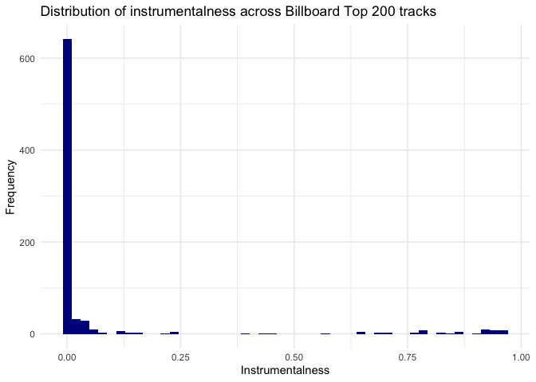
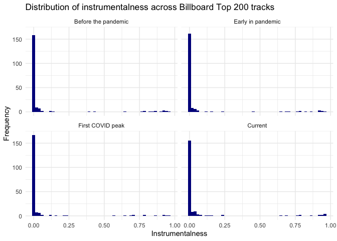

Data Wrangling in R
================

[Next \>\>\>](02_isolating-data.md)

## Welcome

The layout and much of the content in this tutorial borrows from
[RStudio Primers](https://rstudio.cloud/learn/primers), and the
`spotify` data is modified from [this kaggle data
set](https://www.kaggle.com/zaheenhamidani/ultimate-spotify-tracks-db).
I would highly recommend exploring [RStudio
Primers](https://rstudio.cloud/learn/primers) as they are a great
resource for learning basic and intermediate R concepts\!

In this case study, you will explore qualities of your favorite music
genres. Along the way, you will master some of the most useful functions
for isolating and summarizing variables, cases, and values within a data
frame:

  - `select()` and `filter()`, which let you extract columns and rows
    from a data frame
  - `arrange()`, which lets you reorder the rows in your data
  - `%>%`, which organizes your code into reader-friendly “pipes”
  - `group_by()`, which lets you group your data by a factor
  - `summarize()`, which lets you perform a function on your grouped
    data

This tutorial uses the [core tidyverse packages](http://tidyverse.org/),
including `ggplot2`, `tibble`, and `dplyr`.

## Music

First, let’s load the tidyverse suite of packages.

``` r
library(tidyverse)
```

### Spotify data

Now you need to read in your Spotify data. We’ll use the `read_csv`
function for this.

``` r
spotify <- read_csv("data/spotify.csv")
```

    ## Parsed with column specification:
    ## cols(
    ##   genre = col_character(),
    ##   energy = col_double(),
    ##   loudness = col_double(),
    ##   tempo = col_double(),
    ##   danceability = col_double(),
    ##   lyrics = col_character()
    ## )

Let’s take a look at the data set. I will demonstrate two ways to do
this. The first is just to print the data set to the screen.

``` r
spotify
```

    ## # A tibble: 26,000 x 6
    ##    genre    energy loudness tempo danceability lyrics                           
    ##    <chr>     <dbl>    <dbl> <dbl>        <dbl> <chr>                            
    ##  1 Alterna…  0.647    -8.51  79.8        0.709 into into into of him by economi…
    ##  2 Alterna…  0.735    -4.75 163.         0.436 paying fishing realizes Johnson …
    ##  3 Alterna…  0.917    -6.09 141.         0.544 man has happened then to his by …
    ##  4 Alterna…  0.606    -5.06  93.1        0.603 realizes him Johnson I flees his…
    ##  5 Alterna…  0.641    -5.10 142.         0.487 she he his by before then depict…
    ##  6 Alterna…  0.973    -3.64 126.         0.524 she mainland Mark Mr. depicts ec…
    ##  7 Alterna…  0.919    -5.94 108.         0.657 by charter forced into who is aw…
    ##  8 Alterna…  0.889    -4.43 132.         0.611 by forced any Mark slipping main…
    ##  9 Alterna…  0.761    -4.47 119.         0.675 Mark she mainland without Johnso…
    ## 10 Alterna…  0.611    -5.74  79.6        0.584 away airplane I his his she man …
    ## # … with 25,990 more rows

Although get a full look at the data, I use the `View()` function from
base R. This displays your data frame in a spreadsheet-like format that
has basic sorting functionality. Let’s try that\!

``` r
View(spotify)
```

### Trends in your favorite music

You can use the provided `spotify` data to learn more about your
favorite music genres. For instance, which of your favorite musical
genres will pep you up the most?


But before you do, you will need to trim down `spotify`. At the moment,
there are more rows in `spotify` than you need to build your plot.

### An example

To see what I mean, consider how I made the plot above: I began with the
entire data set, which if I plotted everything as a scatterplot would’ve
looked like this. This is a big jumbled mess. It doesn’t tell me much
about what I’m interested in.



I then narrowed the data to just the rows that contain my selected
genres. Here’s how the rows with just the genres I’m interested in look
as a scatterplot.



This tells me a little bit more about the data, but I’m really just
interested in the average. This leads us back to my first plot, which
shows the average energy for each genre.

Your goal in this workshop is to repeat this process for your own
genres. Along the way, you will learn a set of functions that isolate
and summarize information within a data set.

### Sections

1)  [Isolating data](02_isolating-data.md)  
2)  [Piping](03_piping.md)  
3)  [Summarizing data](04_summarizing-data.md)

-----

[Next \>\>\>](02_isolating-data.md)
