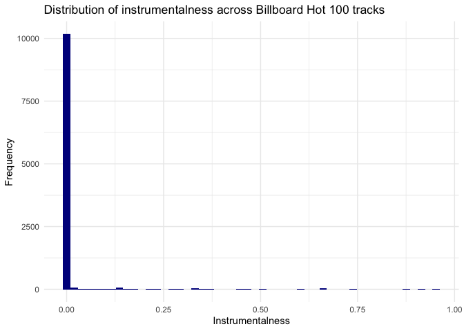

R for Data Analysis
================

[Next &gt;&gt;&gt;](02_isolating-data.md)

Welcome
-------

The layout and much of the content in this tutorial borrows from
[RStudio Primers](https://rstudio.cloud/learn/primers). I would highly
recommend exploring [RStudio
Primers](https://rstudio.cloud/learn/primers) as they are a great
resource for learning basic and intermediate R concepts!

In this case study, we will explore how the musical tastes of the
American public has changed in relation to the COVID-19 pandemic and
other factors. We’re working with a fun data set comprised of the
musical attributes of weekly [Billboard Hot
100](https://www.billboard.com/charts/billboard-200) songs from February
2019 to February 2021. The musical attributes were mined using the
[spotifyr](https://www.rcharlie.com/spotifyr/) interface to the [Spotify
Web API](https://developer.spotify.com/documentation/web-api/)\*. Along
the way, you will master some of the core functions for isolating and
summarizing variables, cases, and values within a data frame:

-   `select()` and `filter()`, which let you extract columns and rows
    from a data frame
-   `arrange()`, which lets you reorder the rows in your data
-   `%>%`, which organizes your code into reader-friendly “pipes”
-   `group_by()`, which lets you group your data by a factor
-   `summarize()`, which lets you perform a function on your grouped
    data

In addition to “wrangling” data, you will learn how to create visually
appealing and effective data visualizations using the `ggplot2` package.
Mastering these two skills will help you efficiently explore your data
and create publishable figures.

This tutorial uses the [core tidyverse packages](http://tidyverse.org/),
including `ggplot2`, `tibble`, `readr`, and `dplyr`.

\* For a PDF with code detailing how I mined the data,  
<a id="raw-url" href="https://github.com/GC-DRI/r_data_analysis_2021/raw/main/00_acquire_spotify_data.pdf">Click
here</a>

Music
-----

First, let’s load the `tidyverse` suite of packages and the `here`
package. The `here` package is a simple package that makes reproducing
file paths much easier. We’ll see it in action in the next code chunk.

    library(tidyverse)
    library(here)

### Spotify data

Now let’s read in the Spotify data. We’ll use the `read_csv` function
for this. Notice our use of the `here` function as well. Rather than
typing in a path, we’re specifying each part of the path within the
function. `here` does the rest, based on the user’s operating system.
This prevents the “forward-slash, back-slash” incompatibility across
Windows and UNIX systems.

`read_csv` also handily outputs the columns and their types it
interprets from the CSV file. This gives you a quick check to make sure
the columns are being correctly read in and interpreted. Which columns
are numeric and which are character?

    spotify <- read_csv(here("data", "spotify.csv"))

    ## 
    ## ── Column specification ────────────────────────────────────────────────────────
    ## cols(
    ##   .default = col_double(),
    ##   track = col_character(),
    ##   artist = col_character(),
    ##   week = col_date(format = ""),
    ##   month = col_character(),
    ##   season = col_character(),
    ##   covid_period = col_character()
    ## )
    ## ℹ Use `spec()` for the full column specifications.

Let’s take a look at the data set. I will demonstrate two ways to do
this, although there are many functions available to view your data. The
first is just to print the data set to the screen. Notice the `<dbl>`
and `<chr>` notes below each column name. This is telling you what type
of data each column contains. You should also see information about how
many rows and columns are in the data. It’s always useful to check both
of these data characteristics during an analysis to make sure you aren’t
getting rid of data that you need and only keeping data that you want.

    spotify

    ## # A tibble: 10,500 x 23
    ##     rank track artist week       danceability energy   key loudness  mode
    ##    <dbl> <chr> <chr>  <date>            <dbl>  <dbl> <dbl>    <dbl> <dbl>
    ##  1     1 7 Ri… Arian… 2019-02-16        0.778  0.317     1   -10.7      0
    ##  2     2 Happ… Marsh… 2019-02-16        0.687  0.792     5    -2.75     1
    ##  3     3 With… Halsey 2019-02-16        0.752  0.488     6    -7.05     1
    ##  4     4 Sunf… Post … 2019-02-16        0.76   0.479     2    -5.57     1
    ##  5     5 Sick… Travi… 2019-02-16        0.834  0.73      8    -3.71     1
    ##  6     6 High… Panic… 2019-02-16        0.579  0.904     5    -2.73     1
    ##  7     7 Than… Arian… 2019-02-16        0.717  0.653     1    -5.63     1
    ##  8     8 Midd… J. Co… 2019-02-16        0.837  0.364     8   -11.7      1
    ##  9     9 Wow.  Post … 2019-02-16        0.829  0.539    11    -7.36     0
    ## 10    10 Girl… Maroo… 2019-02-16        0.611  0.462     0    -7.05     1
    ## # … with 10,490 more rows, and 14 more variables: speechiness <dbl>,
    ## #   acousticness <dbl>, instrumentalness <dbl>, liveness <dbl>, valence <dbl>,
    ## #   tempo <dbl>, duration_ms <dbl>, time_signature <dbl>, month <chr>,
    ## #   day <dbl>, year <dbl>, season <chr>, time_since_covid <dbl>,
    ## #   covid_period <chr>

To display the data in a spreadsheet-like format, try out the `View()`
function from base R. There is some basic sorting functionality that may
be familiar to you. I like to use this function when I’m interested in
quickly scrolling through more than the first 10 or so observations, or
I have a large number of variables I want to page through and not have
to deal with viewing them in the console. Let’s try it out!

    View(spotify)

### Billboard Hot 100 trends

The `spotify` data set we’re using today has a lot of potential for
interesting analyses. For instance, do Billboard Top 200 hits tend to be
more vocal or more instrumental? Looks like they’re predominantly vocal!

Does this pattern change across the time periods we sampled the Hot 100
chart? Doesn’t look like it. Top 40 radio doesn’t really appreciate
intrumental music…

While this makes sense and is somewhat interesting, I think we can
uncover some more interesting patterns in the data with a little
digging.

### Sections

Your goal in this workshop is to uncover more (interesting) patterns in
the `spotify` data. Along the way, you will gain a data wrangling and
visualization tool set that will help you explore and present data in
any context.

1.  [Isolating data and visualizing
    distributions](02_isolating-data.md)  
2.  [Piping and adding color](03_piping.md)  
3.  [Summarizing data and faceting](04_summarizing-data.md)

------------------------------------------------------------------------

[Next &gt;&gt;&gt;](02_isolating-data.md)
